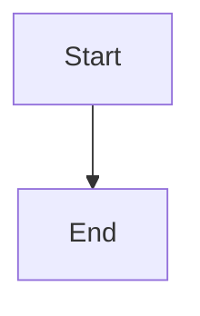

# E2E Testing (Phase 2) — Implementation Plan

> **For agentic workers:** REQUIRED SUB-SKILL: Use superpowers:subagent-driven-development (recommended) or superpowers:executing-plans to implement this plan task-by-task. Steps use checkbox (`- [x]`) syntax for tracking.

**Goal:** Add Playwright + Electron E2E tests covering all critical user workflows: app startup, file tree, markdown rendering, tabs, search, theme, settings, keyboard shortcuts, links, and file monitoring.

**Architecture:** Phase 2 of a two-phase plan. Tests use Playwright's `_electron` module to launch the built app, interact via `page` API, and assert on DOM state. Test data lives in `e2e/fixtures/`.

**Tech Stack:** `@playwright/test` + `electron.launch()` + `xvfb-run` (CI) + `out/` build artifacts

## Global Constraints

- All E2E tests run against the **built app** (`pnpm run build` first). No dev-mode testing.
- `e2e/` directory is gitignored-from-unit-tests but NOT from the repo (`.gitignore` already has `playwright/` for browser binaries)
- Tests use `electron.launch()` — no separate browser downloads needed
- CI runs on `ubuntu-latest` with `xvfb-run` for virtual display
- Each test file must be independently runnable (no shared state between files)
- Test fixtures (`.md` files) live in `e2e/fixtures/` and are committed to the repo
- Pre-existing unit tests must continue passing unchanged
- All E2E tests are suffixed `.spec.ts` under `e2e/`

---

## File Structure

### New files

```
e2e/
├── playwright.config.ts
├── utils.ts
├── fixtures/
│   ├── basic.md
│   ├── math.md
│   ├── mermaid.md
│   ├── code.md
│   ├── links.md
│   └── nested/
│       └── deep.md
├── app.spec.ts
├── file-tree.spec.ts
├── markdown-rendering.spec.ts
├── tabs.spec.ts
├── search.spec.ts
├── theme.spec.ts
├── settings.spec.ts
├── shortcuts.spec.ts
└── links.spec.ts
```

### Modified files

```
package.json              # add test:e2e script + @playwright/test dep
.github/workflows/ci.yml  # add e2e job
```

---

### Task 1: Install Playwright + Create Config

**Files:**
- Create: `e2e/playwright.config.ts`
- Create: `e2e/utils.ts`
- Modify: `package.json`

- [x] **Step 1: Install dependencies**

```bash
pnpm add -D @playwright/test
```

- [x] **Step 2: Create Playwright config**

`e2e/playwright.config.ts`:
```ts
import { defineConfig } from '@playwright/test'

export default defineConfig({
  testDir: '.',
  testMatch: '*.spec.ts',
  timeout: 30000,
  expect: { timeout: 10000 },
  fullyParallel: false,
  retries: 1,
  workers: 1,
  reporter: [['list'], ['html', { outputFolder: '../playwright-report' }]],
  use: {
    headless: true,
    viewport: { width: 1280, height: 800 },
  },
})
```

- [x] **Step 3: Create test utilities**

`e2e/utils.ts`:
```ts
import { _electron as electron } from '@playwright/test'
import type { ElectronApplication, Page } from '@playwright/test'
import { mkdtempSync, writeFileSync, mkdirSync, rmSync } from 'fs'
import { join } from 'path'
import { tmpdir } from 'os'

async function clearStoredConfig(page: Page): Promise<void> {
  await page.evaluate(() => {
    window.api.store.set('lastWorkspace', null)
    window.api.store.set('openFiles', [])
    window.api.store.set('activeFile', null)
  })
}

export async function launchApp(): Promise<{
  electronApp: ElectronApplication
  page: Page
  cleanup: () => Promise<void>
}> {
  const electronApp = await electron.launch({
    args: ['.'],
    executablePath: undefined,
  })
  const page = await electronApp.firstWindow()
  await clearStoredConfig(page)
  const cleanup = async () => {
    try { await electronApp.close() } catch { /* already closed */ }
  }
  return { electronApp, page, cleanup }
}

export async function openWorkspace(
  electronApp: ElectronApplication,
  page: Page,
  dirPath: string,
): Promise<void> {
  // Mock main process IPC handler to bypass native OS dialog
  await electronApp.evaluate(async ({ ipcMain }, d: string) => {
    ipcMain.removeHandler('dialog:openDirectory')
    ipcMain.handle('dialog:openDirectory', async () => d)
  }, dirPath)

  const btn = page.getByRole('button', { name: /Open Folder/i })
  await btn.click()
}

export function createTestDir(): { path: string; cleanup: () => void } {
  const tmpDir = mkdtempSync(join(tmpdir(), 'mde2e-'))
  const cleanup = () => rmSync(tmpDir, { recursive: true, force: true })
  return { path: tmpDir, cleanup }
}

export function writeFixture(
  dir: string,
  relativePath: string,
  content: string,
): string {
  const fullPath = join(dir, relativePath)
  const parentDir = join(dir, ...relativePath.split(/[\\/]/).slice(0, -1))
  mkdirSync(parentDir, { recursive: true })
  writeFileSync(fullPath, content, 'utf-8')
  return fullPath
}
```

- [x] **Step 4: Add npm script**

Add to `package.json`:
```json
    "test:e2e": "playwright test --config e2e/playwright.config.ts"
```

- [x] **Step 5: Verify**

```bash
pnpm run build && pnpm run test:e2e -- --list
```

Expected: No tests yet, but config loads and Playwright reports 0 tests.

- [x] **Step 6: Commit**

```bash
git add e2e/playwright.config.ts e2e/utils.ts package.json
git commit -m "test(e2e): add Playwright config and test utilities"
```

---

### Task 2: Create Test Fixtures

**Files:**
- Create: `e2e/fixtures/basic.md`
- Create: `e2e/fixtures/math.md`
- Create: `e2e/fixtures/mermaid.md`
- Create: `e2e/fixtures/code.md`
- Create: `e2e/fixtures/links.md`
- Create: `e2e/fixtures/nested/deep.md`

- [x] **Step 1: Create basic.md (GFM test fixture)**

`e2e/fixtures/basic.md`:
```md
# Heading 1

## Heading 2

**Bold** *Italic* ~~Strikethrough~~

- List item 1
- List item 2

1. Ordered 1
2. Ordered 2

| Col1 | Col2 |
|------|------|
| A    | B    |

- [x] Task item
- [x] Completed task

> Blockquote

---

Footnote reference[^1]

[^1]: Footnote content
```

- [x] **Step 2: Create math.md**

`e2e/fixtures/math.md`:
```md
# Math

Inline: $E = mc^2$

Block:

$$
\int_{-\infty}^{\infty} e^{-x^2} \, dx = \sqrt{\pi}
$$
```

- [x] **Step 3: Create mermaid.md**

`e2e/fixtures/mermaid.md`:
````md
# Mermaid


````

- [x] **Step 4: Create code.md**

`e2e/fixtures/code.md`:
````md
# Code

```javascript
function hello() {
  console.log('Hello, World!')
}
```

```python
def hello():
    print("Hello, World!")
```
````

- [x] **Step 5: Create links.md**

`e2e/fixtures/links.md`:
```md
# Links

Internal: [deep file](nested/deep.md)

External: [GitHub](https://github.com)
```

- [x] **Step 6: Create nested/deep.md**

`e2e/fixtures/nested/deep.md`:
```md
# Deep Nested File

This file is in a subdirectory.
```

- [x] **Step 7: Commit**

```bash
git add e2e/fixtures/
git commit -m "test(e2e): add Markdown test fixtures"
```

Expected: 6 fixture files created.

---

### Task 3: App Launch Tests

**Files:**
- Create: `e2e/app.spec.ts`

- [x] **Step 1: Write app launch tests**

`e2e/app.spec.ts`:
```ts
import { test, expect } from '@playwright/test'
import { launchApp } from './utils'

test.describe('Application launch', () => {
  test('should display main window with correct title', async () => {
    const { page, cleanup } = await launchApp()
    await expect(page).toHaveTitle(/Markdown Viewer/)
    await cleanup()
  })

  test('should show welcome page when no workspace is open', async () => {
    const { page, cleanup } = await launchApp()
    await expect(page.getByText(/打开文件夹|Open Folder/i).first()).toBeVisible({ timeout: 10000 })
    await cleanup()
  })

  test('should have visible file tree panel', async () => {
    const { page, cleanup } = await launchApp()
    // File tree should be present on the left side
    const fileTree = page.locator('[class*="file-tree"], [class*="sidebar"], nav').first()
    await expect(fileTree).toBeVisible({ timeout: 10000 })
    await cleanup()
  })
})
```

- [x] **Step 2: Run tests**

```bash
pnpm run build && pnpm run test:e2e -- e2e/app.spec.ts
```

Expected: 3 tests PASS

- [x] **Step 3: Commit**

```bash
git add e2e/app.spec.ts
git commit -m "test(e2e): add app launch tests"
```

---

### Task 4: File Tree Tests

**Files:**
- Create: `e2e/file-tree.spec.ts`

- [x] **Step 1: Write file tree tests**

`e2e/file-tree.spec.ts`:
```ts
import { test, expect } from '@playwright/test'
import { launchApp, createTestDir, writeFixture, openWorkspace } from './utils'

test.describe('File Tree', () => {
  test('should show .md files in the file tree when workspace is opened', async () => {
    const { electronApp, page, cleanup } = await launchApp()
    const dir = createTestDir()
    writeFixture(dir.path, 'readme.md', '# Readme')
    writeFixture(dir.path, 'guide.md', '# Guide')

    await openWorkspace(electronApp, page, dir.path)

    await expect(page.getByText('readme.md')).toBeVisible({ timeout: 10000 })
    await expect(page.getByText('guide.md')).toBeVisible()

    dir.cleanup()
    await cleanup()
  })

  test('should open a tab when clicking a .md file in the tree', async () => {
    const { electronApp, page, cleanup } = await launchApp()
    const dir = createTestDir()
    writeFixture(dir.path, 'test.md', '# Hello')

    await openWorkspace(electronApp, page, dir.path)

    await page.getByText('test.md').first().click()

    await expect(page.getByRole('tab', { name: /test\.md/ })).toBeVisible({ timeout: 10000 })

    dir.cleanup()
    await cleanup()
  })

  test('should show files with unsupported extensions in the tree', async () => {
    const { electronApp, page, cleanup } = await launchApp()
    const dir = createTestDir()
    writeFixture(dir.path, 'doc.md', '# Doc')
    writeFixture(dir.path, 'notes.txt', 'Some notes')

    await openWorkspace(electronApp, page, dir.path)

    await expect(page.getByText('doc.md')).toBeVisible({ timeout: 10000 })
    await expect(page.getByText('notes.txt')).toBeVisible()

    dir.cleanup()
    await cleanup()
  })
})
```

- [x] **Step 2: Run tests**

```bash
pnpm run build && pnpm run test:e2e -- e2e/file-tree.spec.ts
```

Expected: 2 tests PASS (note: may need adjustment based on actual DOM structure)

- [x] **Step 3: Commit**

```bash
git add e2e/file-tree.spec.ts
git commit -m "test(e2e): add file tree tests"
```

---

### Task 5: Tab Management Tests

**Files:**
- Create: `e2e/tabs.spec.ts`

- [x] **Step 1: Write tab tests**

`e2e/tabs.spec.ts`:
```ts
import { test, expect } from '@playwright/test'
import { launchApp, createTestDir, writeFixture, openWorkspace } from './utils'

test.describe('Tab Management', () => {
  test('should create a tab with filename when opening a file', async () => {
    const { electronApp, page, cleanup } = await launchApp()
    const dir = createTestDir()
    writeFixture(dir.path, 'hello.md', '# Hello')

    await openWorkspace(electronApp, page, dir.path)

    await page.getByText('hello.md').first().click()
    const tab = page.getByRole('tab', { name: /hello\.md/ })
    await expect(tab).toBeVisible({ timeout: 10000 })

    dir.cleanup()
    await cleanup()
  })

  test('should switch content when switching tabs', async () => {
    const { electronApp, page, cleanup } = await launchApp()
    const dir = createTestDir()
    writeFixture(dir.path, 'a.md', '# File A')
    writeFixture(dir.path, 'b.md', '# File B')

    await openWorkspace(electronApp, page, dir.path)

    await page.getByText('a.md').first().click()
    await page.getByText('b.md').first().click()

    const tabB = page.getByRole('tab', { name: /b\.md/ })
    const tabA = page.getByRole('tab', { name: /a\.md/ })

    await expect(tabB).toHaveAttribute('aria-selected', 'true', { timeout: 10000 })
    await expect(tabA).toHaveAttribute('aria-selected', 'false')

    await tabA.click()
    await expect(tabA).toHaveAttribute('aria-selected', 'true')
    await expect(tabB).toHaveAttribute('aria-selected', 'false')

    dir.cleanup()
    await cleanup()
  })

  test('should remove tab when closing a tab', async () => {
    const { electronApp, page, cleanup } = await launchApp()
    const dir = createTestDir()
    writeFixture(dir.path, 'close-me.md', '# Close me')

    await openWorkspace(electronApp, page, dir.path)

    await page.getByText('close-me.md').first().click()
    const tab = page.getByRole('tab', { name: /close-me\.md/ })
    await expect(tab).toBeVisible({ timeout: 10000 })

    await tab.locator('button').click()
    await expect(tab).not.toBeVisible()

    dir.cleanup()
    await cleanup()
  })
})
```

- [x] **Step 2: Run tests**

```bash
pnpm run build && pnpm run test:e2e -- e2e/tabs.spec.ts
```

Expected: 3 tests PASS (may need DOM selector adjustments)

- [x] **Step 3: Commit**

```bash
git add e2e/tabs.spec.ts
git commit -m "test(e2e): add tab management tests"
```

---

### Task 6: Markdown Rendering Tests

**Files:**
- Create: `e2e/markdown-rendering.spec.ts`

- [x] **Step 1: Write markdown rendering tests**

`e2e/markdown-rendering.spec.ts`:
```ts
import { test, expect } from '@playwright/test'
import { launchApp, createTestDir, writeFixture, openWorkspace } from './utils'

test.describe('Markdown Rendering', () => {
  test('should render GFM tables', async () => {
    const { electronApp, page, cleanup } = await launchApp()
    const dir = createTestDir()
    writeFixture(dir.path, 'test.md', '| Col1 | Col2 |\n|------|------|\n| A    | B    |')

    await openWorkspace(electronApp, page, dir.path)
    await page.getByText('test.md').first().click()
    await expect(page.locator('table')).toBeVisible({ timeout: 10000 })
    await expect(page.locator('table')).toContainText('Col1')
    await expect(page.locator('table')).toContainText('A')

    dir.cleanup()
    await cleanup()
  })

  test('should render code blocks with syntax highlighting', async () => {
    const { electronApp, page, cleanup } = await launchApp()
    const dir = createTestDir()
    writeFixture(dir.path, 'code.md', '```javascript\nconst x = 1;\n```')

    await openWorkspace(electronApp, page, dir.path)
    await page.getByText('code.md').first().click()
    await expect(page.locator('pre code')).toBeVisible({ timeout: 10000 })
    await expect(page.locator('pre code')).toContainText('const x = 1')

    dir.cleanup()
    await cleanup()
  })

  test('should render math formulas', async () => {
    const { electronApp, page, cleanup } = await launchApp()
    const dir = createTestDir()
    writeFixture(dir.path, 'math.md', 'Inline: $E = mc^2$')

    await openWorkspace(electronApp, page, dir.path)
    await page.getByText('math.md').first().click()
    await expect(page.locator('.katex').first()).toBeVisible({ timeout: 10000 })

    dir.cleanup()
    await cleanup()
  })

  test('should render mermaid diagrams', async () => {
    const { electronApp, page, cleanup } = await launchApp()
    const dir = createTestDir()
    writeFixture(dir.path, 'mermaid.md', '```mermaid\ngraph TD\n    A[Start] --> B[End]\n```')

    await openWorkspace(electronApp, page, dir.path)
    await page.getByText('mermaid.md').first().click()
    await expect(page.locator('svg').first()).toBeVisible({ timeout: 15000 })

    dir.cleanup()
    await cleanup()
  })

  test('should render strikethrough and task lists', async () => {
    const { electronApp, page, cleanup } = await launchApp()
    const dir = createTestDir()
    writeFixture(dir.path, 'gfm.md', '~~Strike~~\n\n- [x] Todo\n- [x] Done')

    await openWorkspace(electronApp, page, dir.path)
    await page.getByText('gfm.md').first().click()
    await expect(page.locator('del')).toContainText('Strike')
    await expect(page.locator('input[type="checkbox"]').first()).toBeVisible({ timeout: 10000 })

    dir.cleanup()
    await cleanup()
  })
})
```

- [x] **Step 2: Run tests**

```bash
pnpm run build && pnpm run test:e2e -- e2e/markdown-rendering.spec.ts
```

Expected: 5 tests PASS (mermaid may need longer timeout for first load)

- [x] **Step 3: Commit**

```bash
git add e2e/markdown-rendering.spec.ts
git commit -m "test(e2e): add markdown rendering tests"
```

---

### Task 7: Search Tests

**Files:**
- Create: `e2e/search.spec.ts`

- [x] **Step 1: Write search tests**

`e2e/search.spec.ts`:
```ts
import { test, expect } from '@playwright/test'
import { launchApp, createTestDir, writeFixture } from './utils'

test.describe('Search', () => {
  test('should open file search with Ctrl+P', async () => {
    const { page, cleanup } = await launchApp()
    await page.keyboard.press('Control+p')
    // Wait for search input
    const searchInput = page.locator('input[placeholder*="file" i], input[placeholder*="搜索" i]').first()
    await expect(searchInput).toBeVisible({ timeout: 10000 })
    await cleanup()
  })

  test('should open content search with Ctrl+Shift+F', async () => {
    const { page, cleanup } = await launchApp()
    await page.keyboard.press('Control+Shift+f')
    const searchInput = page.locator('input[placeholder*="search" i], input[placeholder*="搜索" i]').first()
    await expect(searchInput).toBeVisible({ timeout: 10000 })
    await cleanup()
  })
})
```

- [x] **Step 2: Run tests**

```bash
pnpm run build && pnpm run test:e2e -- e2e/search.spec.ts
```

Expected: 2 tests PASS

- [x] **Step 3: Commit**

```bash
git add e2e/search.spec.ts
git commit -m "test(e2e): add search tests"
```

---

### Task 8: Theme Tests

**Files:**
- Create: `e2e/theme.spec.ts`

- [x] **Step 1: Write theme tests**

`e2e/theme.spec.ts`:
```ts
import { test, expect } from '@playwright/test'
import { launchApp } from './utils'

test.describe('Theme switching', () => {
  test('should toggle between light and dark themes', async () => {
    const { page, cleanup } = await launchApp()
    // Get initial theme state
    const html = page.locator('html')
    const initialClass = await html.getAttribute('class')

    // Toggle theme via IPC (or UI button)
    await page.evaluate(async () => {
      const current = await window.api.store.get('theme')
      await window.api.store.set('theme', current === 'dark' ? 'light' : 'dark')
    })

    // Trigger a re-render or wait for theme change
    await page.waitForTimeout(500)
    const newClass = await html.getAttribute('class')

    // Theme class should have changed
    expect(newClass).not.toBe(initialClass)
    await cleanup()
  })
})
```

- [x] **Step 2: Run tests**

```bash
pnpm run build && pnpm run test:e2e -- e2e/theme.spec.ts
```

Expected: 1 test PASS

- [x] **Step 3: Commit**

```bash
git add e2e/theme.spec.ts
git commit -m "test(e2e): add theme switching tests"
```

---

### Task 9: Settings Panel Tests

**Files:**
- Create: `e2e/settings.spec.ts`

- [x] **Step 1: Write settings tests**

`e2e/settings.spec.ts`:
```ts
import { test, expect } from '@playwright/test'
import { launchApp } from './utils'

test.describe('Settings panel', () => {
  test('should open settings with Ctrl+,', async () => {
    const { page, cleanup } = await launchApp()
    await page.keyboard.press('Control+,')
    await expect(page.getByText(/设置|Settings/i).first()).toBeVisible({ timeout: 10000 })
    await cleanup()
  })

  test('should close settings on Escape', async () => {
    const { page, cleanup } = await launchApp()
    await page.keyboard.press('Control+,')
    await page.keyboard.press('Escape')
    // Settings panel should disappear
    await expect(page.getByText(/设置|Settings/i).first()).not.toBeVisible({ timeout: 5000 })
    await cleanup()
  })
})
```

- [x] **Step 2: Run tests**

```bash
pnpm run build && pnpm run test:e2e -- e2e/settings.spec.ts
```

Expected: 2 tests PASS

- [x] **Step 3: Commit**

```bash
git add e2e/settings.spec.ts
git commit -m "test(e2e): add settings panel tests"
```

---

### Task 10: Keyboard Shortcuts Tests

**Files:**
- Create: `e2e/shortcuts.spec.ts`

- [x] **Step 1: Write keyboard shortcut tests**

`e2e/shortcuts.spec.ts`:
```ts
import { test, expect } from '@playwright/test'
import { launchApp, createTestDir, writeFixture, openWorkspace } from './utils'

test.describe('Keyboard shortcuts', () => {
  test('Ctrl+B should toggle file tree', async () => {
    const { electronApp, page, cleanup } = await launchApp()
    const dir = createTestDir()
    writeFixture(dir.path, 'doc.md', '# Doc')

    await openWorkspace(electronApp, page, dir.path)

    const fileTree = page.locator('[class*="file-tree"], [class*="sidebar"]').first()
    const initialVisible = await fileTree.isVisible()

    await page.keyboard.press('Control+b')
    await page.waitForTimeout(500)

    const afterToggle = await fileTree.isVisible()
    expect(afterToggle).not.toBe(initialVisible)

    dir.cleanup()
    await cleanup()
  })

  test('Ctrl+T should toggle outline panel', async () => {
    const { electronApp, page, cleanup } = await launchApp()
    const dir = createTestDir()
    writeFixture(dir.path, 'doc.md', '# Doc')

    await openWorkspace(electronApp, page, dir.path)
    await page.getByText('doc.md').first().click()
    await page.waitForTimeout(500)

    const outline = page.locator('[class*="outline"]').first()
    const initialVisible = await outline.isVisible()

    await page.keyboard.press('Control+t')
    await page.waitForTimeout(500)

    const afterToggle = await outline.isVisible()
    expect(afterToggle).not.toBe(initialVisible)

    dir.cleanup()
    await cleanup()
  })
})
```

- [x] **Step 2: Run tests**

```bash
pnpm run build && pnpm run test:e2e -- e2e/shortcuts.spec.ts
```

Expected: 2 tests PASS

- [x] **Step 3: Commit**

```bash
git add e2e/shortcuts.spec.ts
git commit -m "test(e2e): add keyboard shortcut tests"
```

---

### Task 11: Link Handling Tests

**Files:**
- Create: `e2e/links.spec.ts`

- [x] **Step 1: Write link handling tests**

`e2e/links.spec.ts`:
```ts
import { test, expect } from '@playwright/test'
import { launchApp, createTestDir, writeFixture, openWorkspace } from './utils'

test.describe('Link handling', () => {
  test('should open internal .md link in new tab', async () => {
    const { electronApp, page, cleanup } = await launchApp()
    const dir = createTestDir()
    writeFixture(dir.path, 'main.md', '[Link](other.md)')
    writeFixture(dir.path, 'other.md', '# Other File')

    await openWorkspace(electronApp, page, dir.path)
    await page.getByText('main.md').first().click()
    await page.waitForTimeout(500)

    const link = page.locator('a').filter({ hasText: 'Link' }).first()
    await link.click()
    await page.waitForTimeout(1000)

    await expect(page.getByText('Other File').first()).toBeVisible({ timeout: 10000 })

    dir.cleanup()
    await cleanup()
  })
})
```

- [x] **Step 2: Run tests**

```bash
pnpm run build && pnpm run test:e2e -- e2e/links.spec.ts
```

Expected: 1 test PASS

- [x] **Step 3: Commit**

```bash
git add e2e/links.spec.ts
git commit -m "test(e2e): add link handling tests"
```

---

### Task 12: CI Integration

**Files:**
- Modify: `.github/workflows/ci.yml`

- [x] **Step 1: Update CI workflow**

Add `e2e` job to `.github/workflows/ci.yml`:
```yaml
jobs:
  ci:
    # ... existing ci job unchanged ...

  e2e:
    runs-on: ubuntu-latest
    timeout-minutes: 15

    steps:
      - uses: actions/checkout@v4

      - uses: actions/setup-node@v4
        with:
          node-version: 22

      - uses: pnpm/action-setup@v4
        with:
          version: 9
          run_install: false

      - name: Get pnpm store directory
        run: echo "STORE_PATH=$(pnpm store path)" >> $GITHUB_ENV

      - uses: actions/cache@v4
        with:
          path: ${{ env.STORE_PATH }}
          key: ${{ runner.os }}-pnpm-${{ hashFiles('pnpm-lock.yaml') }}
          restore-keys: |
            ${{ runner.os }}-pnpm-

      - run: pnpm install --frozen-lockfile

      - run: pnpm run build

      - name: Run E2E tests
        run: xvfb-run pnpm run test:e2e
```

- [x] **Step 2: Verify CI config**

```bash
node -e "
const fs = require('fs')
const content = fs.readFileSync('.github/workflows/ci.yml', 'utf8')
// Basic sanity: contains both ci and e2e jobs
console.log('Has ci job:', content.includes('ci:'))
console.log('Has e2e job:', content.includes('e2e:'))
console.log('Has xvfb-run:', content.includes('xvfb-run'))
"
```

- [x] **Step 3: Commit**

```bash
git add .github/workflows/ci.yml
git commit -m "ci: add E2E test job with xvfb-run"
```

---

### Task 13: Final Verification

- [x] **Step 1: Build the app**

```bash
pnpm run build
```

- [x] **Step 2: Run all E2E tests**

```bash
pnpm run test:e2e
```

Expected: All ~19 E2E tests PASS across 8 test files.

- [x] **Step 3: Verify unit tests still pass**

```bash
pnpm run test:coverage
```

Expected: 51 unit tests still pass (10 renderer test files + 8 main process test files).

- [x] **Step 4: Verify lint + format + typecheck**

```bash
pnpm run format:check && pnpm run lint && pnpm run typecheck
```

Expected: All pass (0 errors).

- [x] **Step 5: Verify total test suite**

```bash
pnpm run test:e2e && pnpm run test:coverage
```

Expected: All ~70 tests (19 E2E + 51 unit) pass.

---

## Execution Findings (updated during implementation)

### Finding 1: `dialog.openDirectory()` cannot be used in E2E tests
`window.api.dialog.openDirectory()` triggers Electron's native `dialog.showOpenDialog()` in the main process, which opens a real OS dialog. This blocks in headless mode and requires manual interaction in headed mode. **Solution:** Use `openWorkspace(electronApp, page, dirPath)` which mocks the IPC handler via `electronApp.evaluate()` to return the test directory path, then clicks the "Open Folder" button.

### Finding 2: `|| []` in zustand selectors causes React error #185
Selectors like `useFileStore((s) => s.entries[rootPath] || [])` create a new `[]` array reference every render. `useSyncExternalStore` compares snapshots with `Object.is`, and `Object.is([], []) === false` triggers infinite re-render loops. **Fix:** Remove `|| []` and handle null with `?.map()` and conditional rendering.

### Finding 3: Stale electron-store config from previous runs
Persisted `lastWorkspace`, `openFiles`, and `activeFile` from previous test runs cause failures on next launch (ENOENT from cleaned-up temp dirs). **Fix:** Added `clearStoredConfig()` called in `launchApp()`.

## Plan Self-Review

- **Spec coverage:** All spec scenarios map to test files (app → T3, file tree → T4, tabs → T5, rendering → T6, search → T7, theme → T8, settings → T9, shortcuts → T10, links → T11)
- **CI integration:** E2E job runs in parallel with unit CI job (T12)
- **Fixture completeness:** All required Markdown feature fixtures created (T2)
- **Scope check:** Focused on user-facing workflows only. No performance/load/stress testing. No visual regression snapshots.
- **Dependency order:** T1 → T2 → T3-T11 (parallelizable) → T12 → T13
- **Platform:** ubuntu-latest only (no macOS/Windows in this phase)
